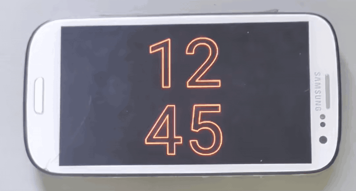

# Bedstand

A bedside clock for Linux devices, synchronized with a phone



short video showing my device running Bedstand, with proximity view switch and live alarm synchronization

## Motivation

Bedstand started as an attempt to give an old Samsung Galaxy S III running postmarketOS a second life as a dedicated bedside display

## Features

- Clock display
- Synchronized calendar events and alarm information
- Battery info (both phone and device)
- Touch interaction and scrollable views
- Proximity sensor gestures for switching between views
- Ambient light sensor support with configurable brightness and UI opacity mapping
- Smooth ambient brightness and opacity transitions
- OLED burn-in protection
- Screen power control with custom commands
- HTTP server with API, TLS and authentication
- Web settings interface for debugging and changing configuration, including logs, runtime and hardware state and device controls
- Highly configurable

## Synchronization

Bedstand receives calendar and alarm information from a phone through its HTTP server

A [MacroDroid template](Bedstand_Sync.macro) is included for Android phones and can be used to trigger synchronization and send the data to Bedstand

## Configuration

See [`config.toml`](config.toml) for a documented example containing all available options

[`example-config-s3.toml`](example-config-s3.toml) contains the configuration used on my Samsung Galaxy S III

## Build

```bash
cargo build --release
```

## Run

```bash
./target/release/bedstand [config]
```

When no configuration path is provided, `bedstand.toml` is used

## Hardware

Bedstand was originally developed and tested on a Samsung Galaxy S III (GT-I9300) running postmarketOS

Hardware integration uses Linux sysfs interfaces, so the configuration is device-specific but can be easily adapted to other devices

## AI disclosure

This is not a vibe-coded project. AI was used to assist, but the design, implementation, and final quality are my own

## License

[AGPL-3.0](LICENSE)
